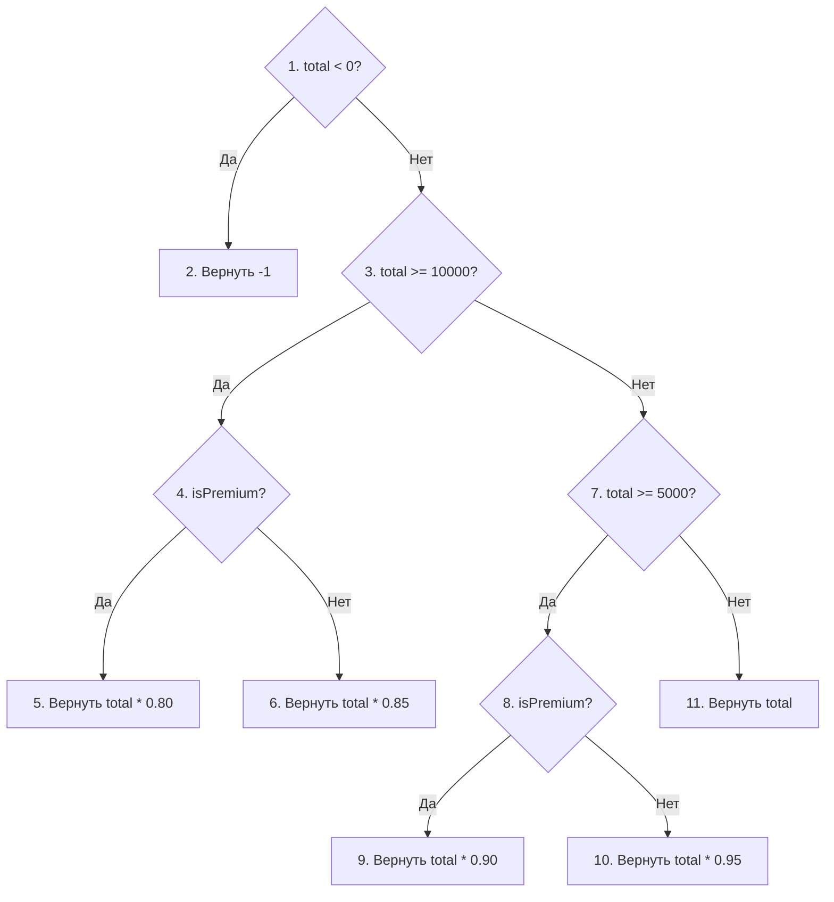
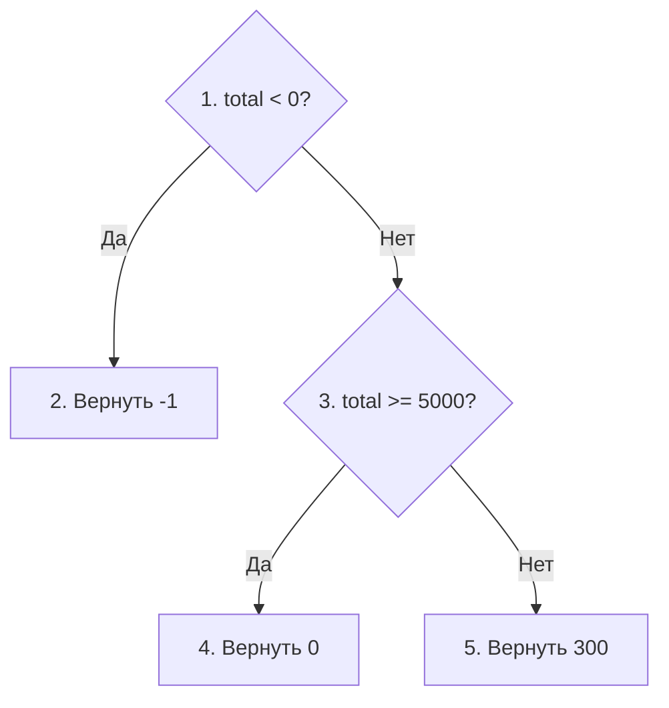
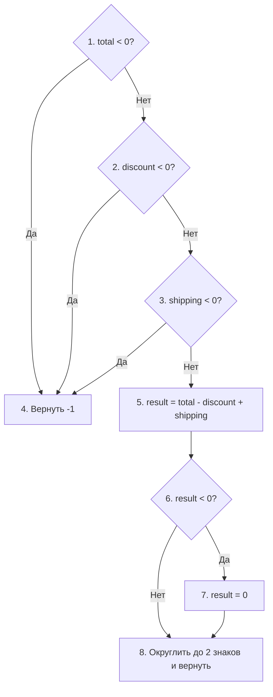
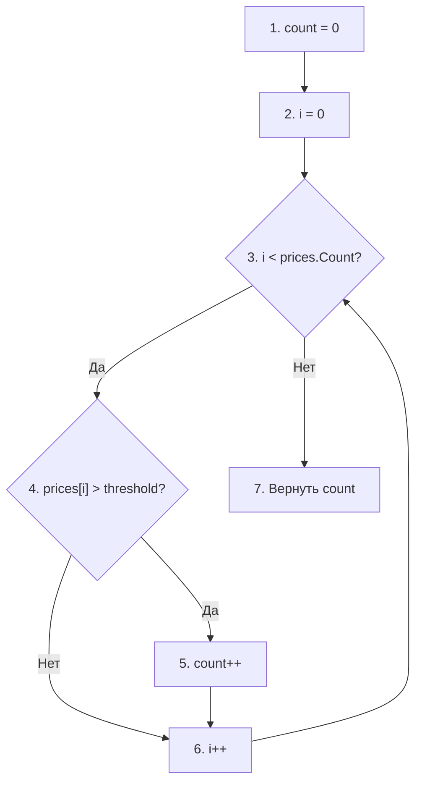
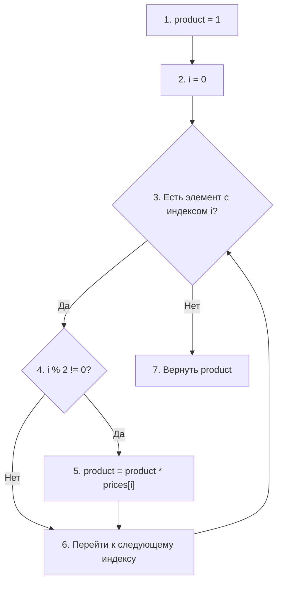
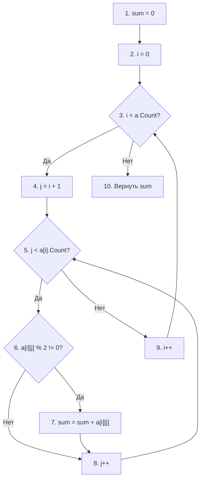

## 1. ApplyDiscount

```mermaid
flowchart TD
    A{"1. total < 0?"} -->|Да| B["2. Вернуть -1"]
    A -->|Нет| C{"3. total >= 10000?"}

    C -->|Да| D{"4. isPremium?"}
    D -->|Да| E["5. Вернуть total * 0.80"]
    D -->|Нет| F["6. Вернуть total * 0.85"]

    C -->|Нет| G{"7. total >= 5000?"}
    G -->|Да| H{"8. isPremium?"}
    G -->|Нет| K["11. Вернуть total"]

    H -->|Да| I["9. Вернуть total * 0.90"]
    H -->|Нет| J["10. Вернуть total * 0.95"]
```

## 2. CalcShipping

```mermaid
flowchart TD
    A{"1. total < 0?"} -->|Да| B["2. Вернуть -1"]
    A -->|Нет| C{"3. total >= 5000?"}
    C -->|Да| D["4. Вернуть 0"]
    C -->|Нет| E["5. Вернуть 300"]
```

## 3. FinalPrice

```mermaid
flowchart TD
    A{"1. total < 0?"} -->|Да| D["4. Вернуть -1"]
    A -->|Нет| B{"2. discount < 0?"}

    B -->|Да| D
    B -->|Нет| C{"3. shipping < 0?"}

    C -->|Да| D
    C -->|Нет| E["5. result = total - discount + shipping"]

    E --> F{"6. result < 0?"}
    F -->|Да| G["7. result = 0"]
    F -->|Нет| H["8. Округлить до 2 знаков и вернуть"]
    G --> H
```

## 4. CountExpensiveItems 

```mermaid
flowchart TD
    A["1. count = 0"] --> B["2. i = 0"]
    B --> C{"3. i < prices.Count?"}

    C -->|Да| D{"4. prices[i] > threshold?"}
    C -->|Нет| G["7. Вернуть count"]

    D -->|Да| E["5. count++"]
    D -->|Нет| F["6. i++"]

    E --> F
    F --> C
```

## 5. ProductOddIndices

```mermaid
flowchart TD
    A["1. product = 1"] --> B["2. i = 0"]
    B --> C{"3. Есть элемент с индексом i?"}

    C -->|Да| D{"4. i % 2 != 0?"}
    C -->|Нет| G["7. Вернуть product"]

    D -->|Да| E["5. product = product * prices[i]"]
    D -->|Нет| F["6. Перейти к следующему индексу"]

    E --> F
    F --> C
```

## 6. SumOddAboveMainDiagonal 

```mermaid
flowchart TD
    A["1. sum = 0"] --> B["2. i = 0"]
    B --> C{"3. i < a.Count?"}

    C -->|Да| D["4. j = i + 1"]
    C -->|Нет| J["10. Вернуть sum"]

    D --> E{"5. j < a[i].Count?"}
    E -->|Да| F{"6. a[i][j] % 2 != 0?"}
    E -->|Нет| I["9. i++"]

    F -->|Да| G["7. sum = sum + a[i][j]"]
    F -->|Нет| H["8. j++"]

    G --> H
    H --> E
    I --> C
```
